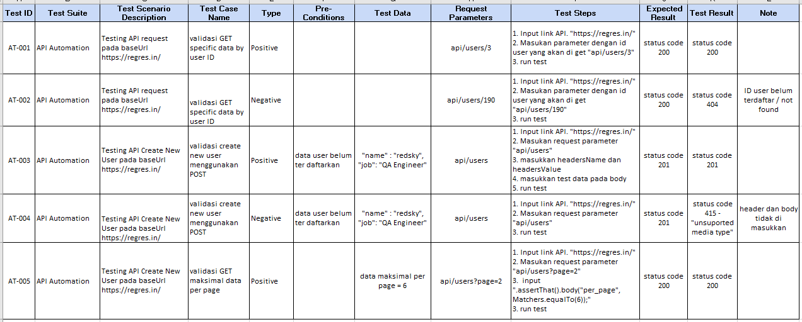
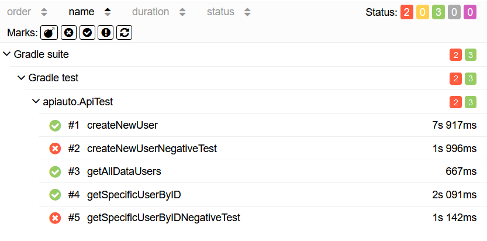

# API Automation Test
### Testing API Automation with Positive and Negative Test

```
API Testing         : https://reqres.in/
Language            : Java
Framework           : TestNG
Library             : Rest Assured
Reporting Library   : Allure
```

### Test Cases


Jalankan test via terminal dengan menjalankan gradle command
```
./gradlew clean test
```

Jalankan command untuk __generate allure report__ via terminal
```
allure serve build/allure-results
```

### Allure Results

